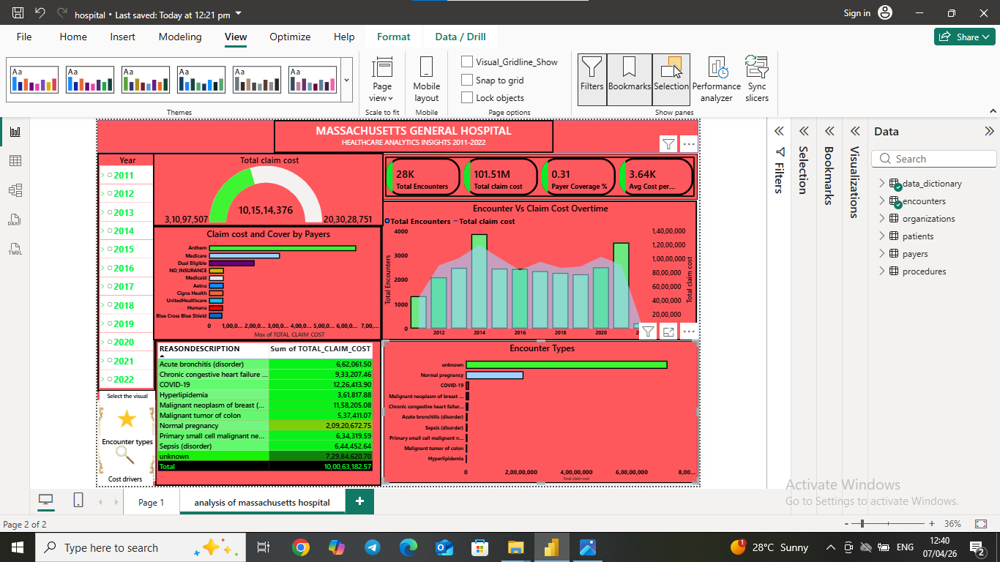

# # Massachusetts General Hospital - Healthcare Analytics Dashboard (2011-2022)

> An interactive **Power BI dashboard** analyzing 12 years of hospital claims data to drive healthcare cost optimization and operational insights.

---

## 📋 Project Objective

### Business Problem
Healthcare costs are continuously rising. Hospital administrators need clear visibility into:
- Which medical conditions are driving the highest costs
- How costs and patient volume have trended over time
- Which payers contribute most to revenue
- High-risk and high-cost encounter types

### Project Objectives
- **Analyze 12 years** (2011–2022) of hospital claims data from Massachusetts General Hospital
- Identify **top cost-driving conditions** and their financial impact
- Track **trends in total claim costs** and **encounter volume** over time
- Evaluate **payer performance** and cost distribution
- Provide **actionable insights** for cost control, resource planning, and strategic decision-making
- Create an **interactive dashboard** for easy exploration by stakeholders

### Key Goals Achieved
- Calculated total claim cost of **$101.51 Million** across **28,000+ encounters**
- Highlighted high-impact conditions like Chronic Congestive Heart Failure, COVID-19, and Hyperlipidemia
- Delivered payer-wise cost comparison and trend analysis

---

## 🛠️ Tech Stack

- **Visualization Tool**: Power BI Desktop
- **Data Transformation**: Power Query (ETL)
- **Analytics & Calculations**: DAX Measures
- **Visualizations**: Cards, Donut Charts, Bar Charts, Line Charts, Tables, Slicers
- **Data Modeling**: Star Schema with relationships between Encounters, Patients, Payers, and Procedures

---

## 📊 Data Source

- **Dataset**: Hospital Claims & Encounters Data (2011–2022)
- **Source**: Synthetic / Sample dataset representing Massachusetts General Hospital
- **Key Tables**:
  - Encounters
  - Patients
  - Payers
  - Procedures
  - Claim Costs
- **Time Period**: 2011 to 2022

---

## 🎯 Key Insights

- **Total Performance**: $101.51M total claim cost | 28K encounters | 0.31% Payer Coverage
- **Top Cost Drivers**: Chronic Congestive Heart Failure, COVID-19, Hyperlipidemia
- **Trend Analysis**: Significant increase in claim costs and encounters post-2018
- **Payer Analysis**: Medicare and Medicaid are major contributors to total claims
- **Encounter Types**: "Unknown" and "Normal Pregnancy" are among the top categories

---

## 📁 Project Structure
Massachusetts-General-Hospital---Healthcare-Analytics-Dashboard-2011-2022-
